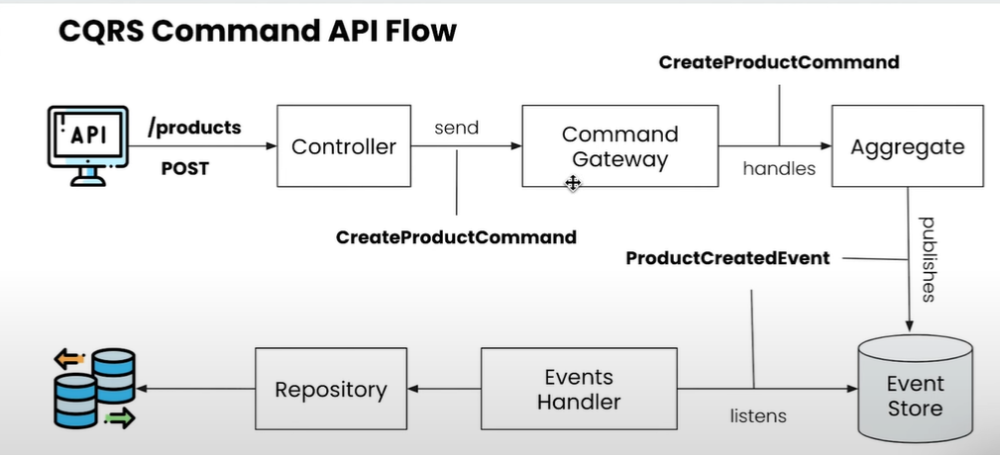
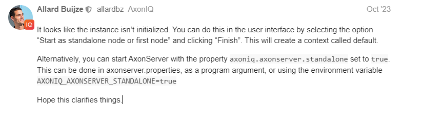

1. Go to localhost:8024 
   - see the exposed port on the docker compose file


ADDITIONAL:
  - add the spring boot starter module for axon framework
```groovy
// https://mvnrepository.com/artifact/org.axonframework/axon-spring-boot-starter
implementation 'org.axonframework:axon-spring-boot-starter:4.9.3'
```

  - add also the Guava: Google Core libraries for Java
```groovy
// https://mvnrepository.com/artifact/com.google.guava/guava
implementation 'com.google.guava:guava:33.0.0-jre'

```

## Create package structure:
  - `command`
    - `api`
      - `controller`
        - `ProductCommandController`
      - `model`
  - `query`
    - `api`





### **`ERROR: Connecting to AxonServer node[localhost:8124]`**
solution:
