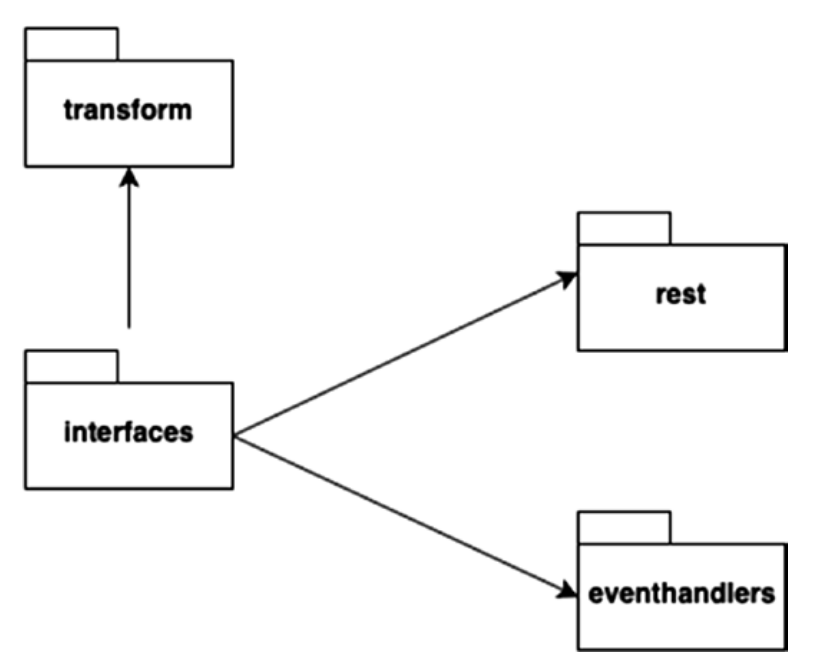
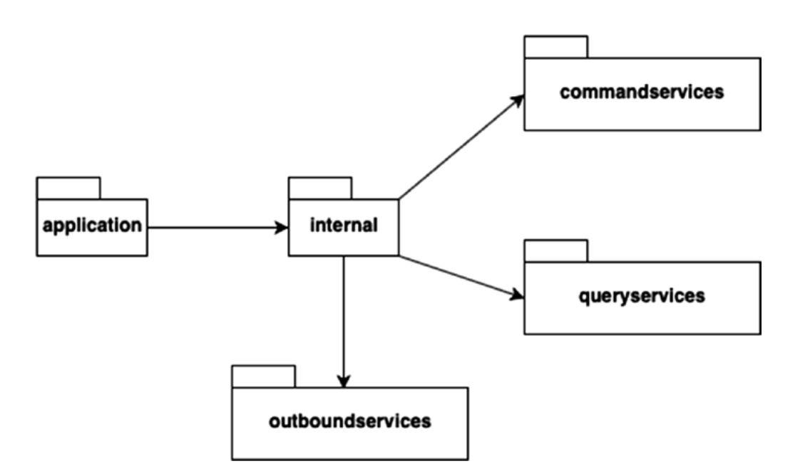
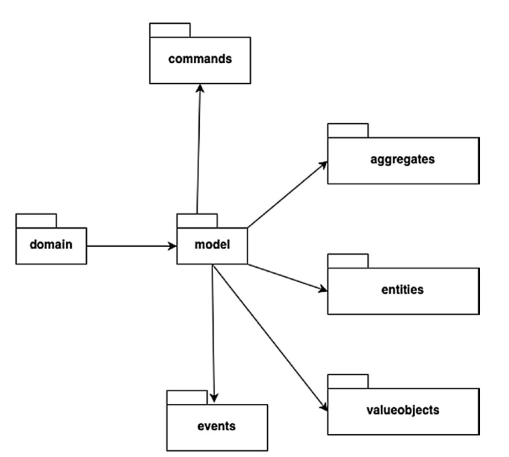
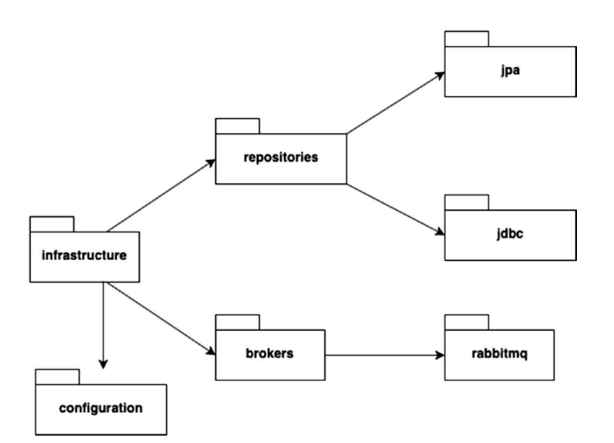

INTRO TO DDD

## Step 1: **Create the 4 package**

PACKAGE STRUCTURE
  - `interface` -> Inbound Adaptors
  - `application` -> Application Services
  - `domain` -> Domain Model
  - `infrastructure` -> Outbound Adaptors
  
1. `Interface`
   1. encloses all the inbound interfaces to our Bounded Context classified by the **communication protocol**
   2. MAIN PURPOSE:
      1. negotiate the protocol on behalf of the Domain Model(REST API, WebSocket, FTP, custom protocol)
   3. Example:
      1. it provides REST APIs for sending 
         1. **State Changing Requests** aka **Commands**
         2. **State Retrieval Requests** aka **Queries**
   4. Subpackages
      1. `rest`
      2. `eventhandlers`
         1. events generated by other bounded context
      3. `transform`
         1. translate API resource/event data to command/query model required by the Domain Model
   5. 
   
2. `Application`
   1. Serves as Facade to the Bounded Context's Domain Model
   2. provide facade services to dispatch Commands and Queries to the underlying Domain Model
   3. Core concerns:
      1. Participate in Command Query Dispatching
      2. Invoke infrastructural components where necessary as part of CQ processing
      3. provide Centralized concern (e.g. Logging, Security, Metrics) for the underlying Domain Model
      4. Make callouts to other Bounded Contexts
   4. 

4. `Domain`
   1. Heart of the Bounded Context's Domain Model
   2. contains implementation of core business logic
   3. core classes:
      1. Aggregates
      2. Entities
      3. Value Objects
      4. Commands
      5. Events
   4. 
5. `Infrastructure`
   1. main purpose:
      1. State -> for any state changing operation, we need it to be stored, Datastore(Database) [JDBC/JPA/MYSQL]
      2. Event -> when a bounded context needs to communicate a state change event(rabbitMq, Kafka)
      3. Configuration
   2. 