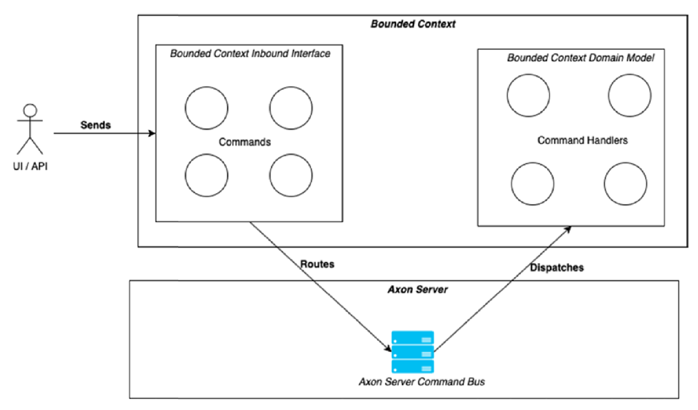

**Domain Sourcing**
vs
**Event Sourcing**

Commands
  - carry the intent to change teh state of the Aggregates within the various Bounded Context

Command Hanlders
  - Axon provides first class support for handling Commands via `Command Handlers`
  - routines which are placed in an aggregate
    - they take a specific Command
      - state change intent as the main input
      - via stereotype annotation `@CommandHandler`
  - Axon also supports placing these commands in an external class

Events
  - notify the change of state of an Aggregate within the Bounded Context to interested subscribers
  - Event classes have no specific annotations required
  - Aggregates use lifecycle methods that Axon provides to push the events out to the 
    - event store 
    - event router - after processing of a Command

Event Handlers
  - Where consumption of Events is handled
    - specific to the events that the Event Handler subscribes
  - `@EventHandler` - steretype annotation place on methods within regullar POJOs which enables the consumption and subsequent processing of events
  

Query
  - intent to retrieve the state of aggregates within our Bounded Contexts
  - Queries in Axon are hadnled via `@QueryHandler`

Query Handler
  - relies on Read Model / Projection data storage to retrieve Aggregate state

### Axon Dispatch Model Components

#### Any bounded context participates in four types of operation
1. Handle Commands to change state
2. Handle Queries to retrieve state
3. Publish Events / consume Events
4. Saga(s)

#### Command Bus
- Command Bus/Gateway helps in dispatching of Commands to their corresponding Command Handlers for processing

1. CommandBus 
   - axon infra component which routes the Command to the corresponding CommandHandler
   - multiple implmentation of CommandBus
     - SimpleCommandBus
     - AxonServerCommandBus
       - utilize Axon Server as the dispatching mechanism for various commands
       - 
     - Asynchronous
     - DisruptorCommandBUs
     - DistributedCommandBus
2. CommandGateway 
   - axon infra utility component
   - wrapper around the CommandBus
     - helps in eliminating boilerplate code.

### PREFERRED FILE STRUCTURE
- core
  - application
    - modules
      - student
        - commands
          - create
            - CreateStudentCommand
            - CreateStudentCommandHandler
            - CreateStudentCommandValidator
            - CreateStudentRequest
        - queries
          - get
            - GetStudentByIdQuery
            - GetStudentQueryHandler
            - GetStudentResponse
  - domain
    - abstractions
      - ex: StudentRepository --- only an `INTERFACE`
    - entities
      - ex: Student, BaseEntity - which is abstract
    - exceptions
- external
  - infrastructure
    - config
    - repositories
  - interfaces
    - rest
    - eventhandlers