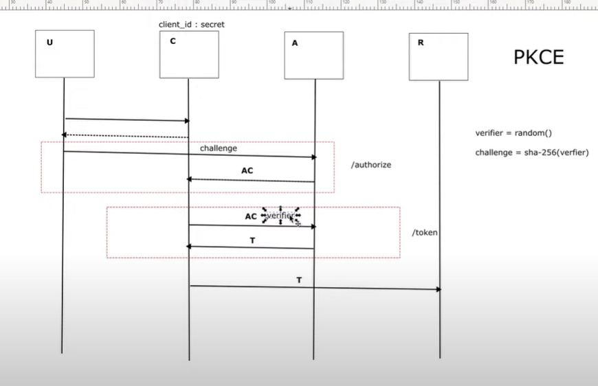

PKCE
  - Proof Key for proof exchange
    - improvement to OAuth2
    - problem when client id, secret, auth code can be stolen
  - Verifier = random()
  - Challenge = sha-256(verifier)
    - Hashed
      - hash - you cant get input of an output
        - you cant `decode`
        - you can tell if it matches, but you cant go back to input

http://localhost:8080/oauth2/authorize?response_type=code&client_id=client&scope=open_id&redirect_uri=http://my-redirect_url.com